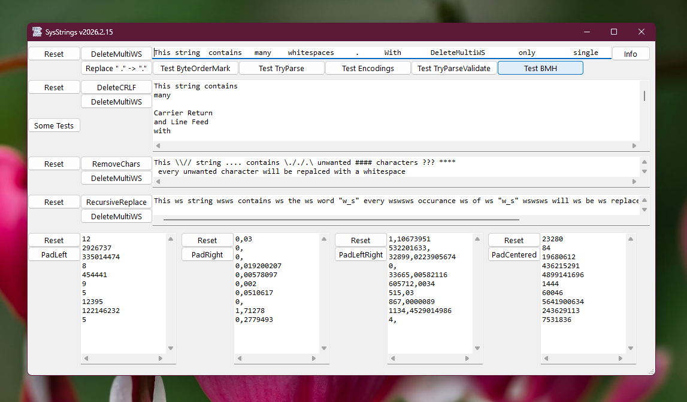

# Sys_Strings  
## Some useful functions for working with Strings   

 

The main part of this repo is the module MString.bas. Collecting codes in this module started around 2005.  
It is a library containing all functions related to character strings, which today includes many very useful and therefore countless times tested functions.  
  
* special functions
  FormatMByte, PtrToString, PtrToStringCo  
  
* Replacing or deleting parts of a string
  Trim0, DeleteMultiWS, DeleteCRLF, RemoveChars, RecursiveReplace, RecursiveReplaceSL, ReplaceAll  
  
* TryParse-, TryParseMess-, TryParseValidate- & ToStr functions
  for all intrinsic primitive datatypes: Byte, Integer, Long, LongLong, Single, Double, Currency, Decimal, Date, String
  for hexadecimal, octal and binary string representations of int-types: Hex, HexInt, HexLng, Oct, OctInt, OctLng, BinInt, BinLng  
  
* converting int-Types to hexadecimal, octal, binary
  IsHex, IsOct, IsBin, CHexToVBHex
  Hex2, Hex4, Hex8, Hex16, Dec2, Oct3, Oct6, Oct11, Oct22, Bin8, Bin16, Bin32, Bin64  
  
* Boolean: BoolToYesNo, CBol, StrToBol, BolToStr
  
* VB related functions
  ByteArray_ToHex, VBVarType_TryParse, VBVarType_ToStr, VBVarType_IsNumeric, VBTypeIdentifier_TryParse, VBTypeIdentifier_ToStr
  Identifier_TryParse, Array_TryParse, Array_ToStr, Numeric_TryParse, Literal_TryParse  
  
* Functions of .net System.String
  Contains, ContainsOneOf, EndsWith, IndexOf, Insert, LastIndexOf, GetDecimalSeparator, PadLeft, PadCentered, PadRight, PadLeftRightDecSep
  Remove, RemoveFromRightStartingWith, StartsWith, Substring, Between, ToCharArray, SArray, SCArray, AdverbNum_ToStr  
  
* Unicode-BOM functions
  IsBOM, Long_IsBOM, EByteOrderMark_Parse, EByteOrderMark_ToStr, ConvertFromUTF8  
  
* Some Special functions
  App_EXEName, GetGreekAlphabet, MsgBoxW, GetTabbedText  
  
* Keyboard functions
  IsAlt, IsCtrl, IsShift, IsCtrlAlt, IsShiftAlt, IsCtrlShift, IsCtrlShiftAlt  
  
* Encoding functions
  InitBase64, ReverseCode, Base64_EncodeString, Base64_DecodeString, Base64_EncodeBytes, Base64_DecodeBytes, JSONEscaped_Decode, URLEscaped_DecodeFromUTF8, Encoding_GetString  
  
* finding text inside a string with algo Boyer-Moore-Horspool 
  Find, FindNext, FindBMH, FindNextBMH, ClearFind, BMH_Find  
  
For this repo you need the modules
* MPtr.bas  from the repo Ptr_Pointers
* MMath.bas from the repo Math
  

