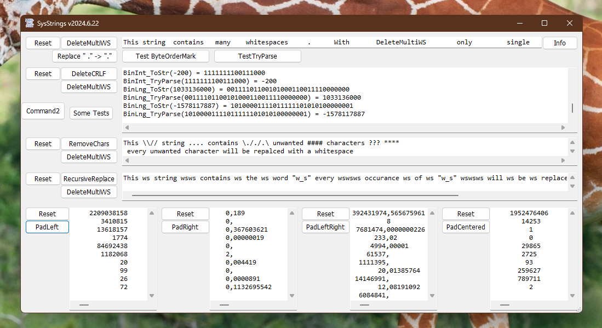

# Sys_Strings  
## Some useful functions for working with Strings   

 

Some functions from .net System.String and some other useful string-functions. E.g. Replacing, RecursiveReplace, Padding Left or Right.  
Collecting codes in this project started around 2005.  

